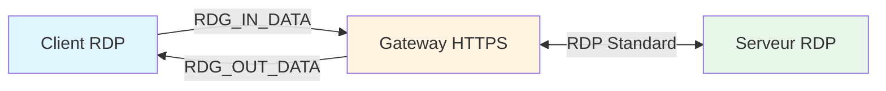
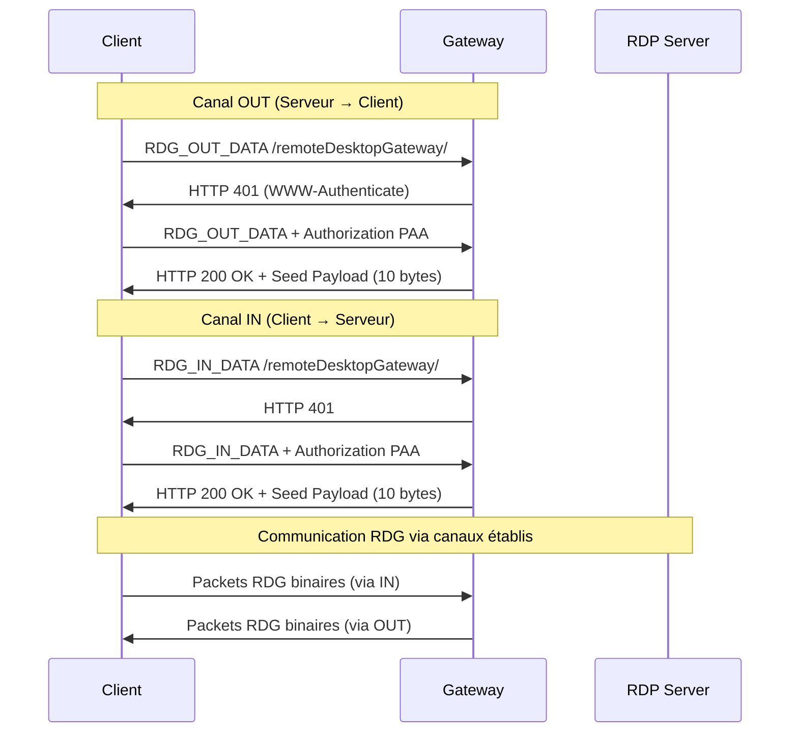
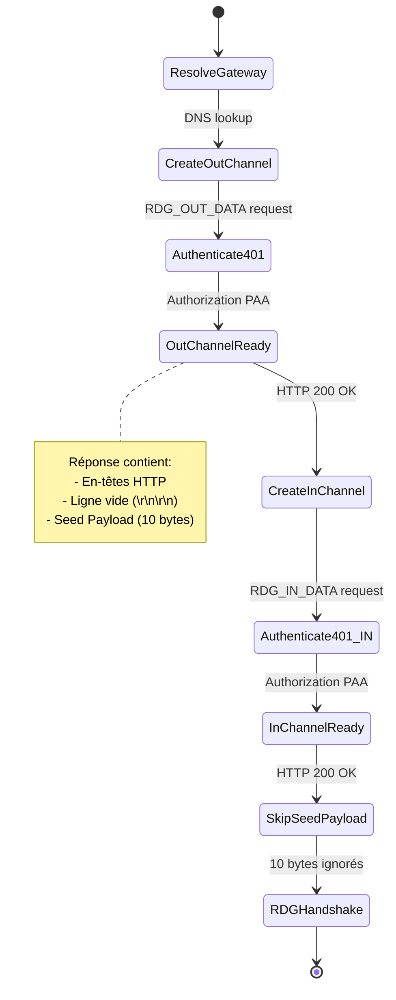
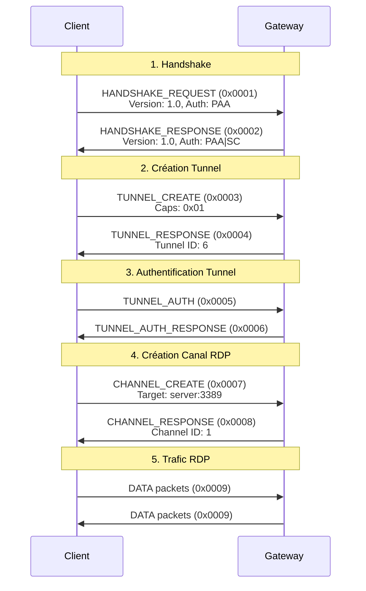
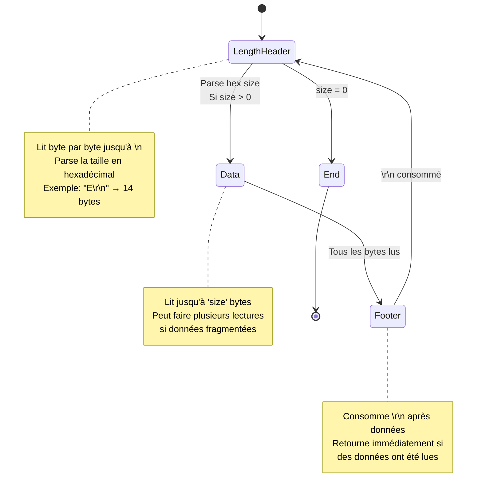
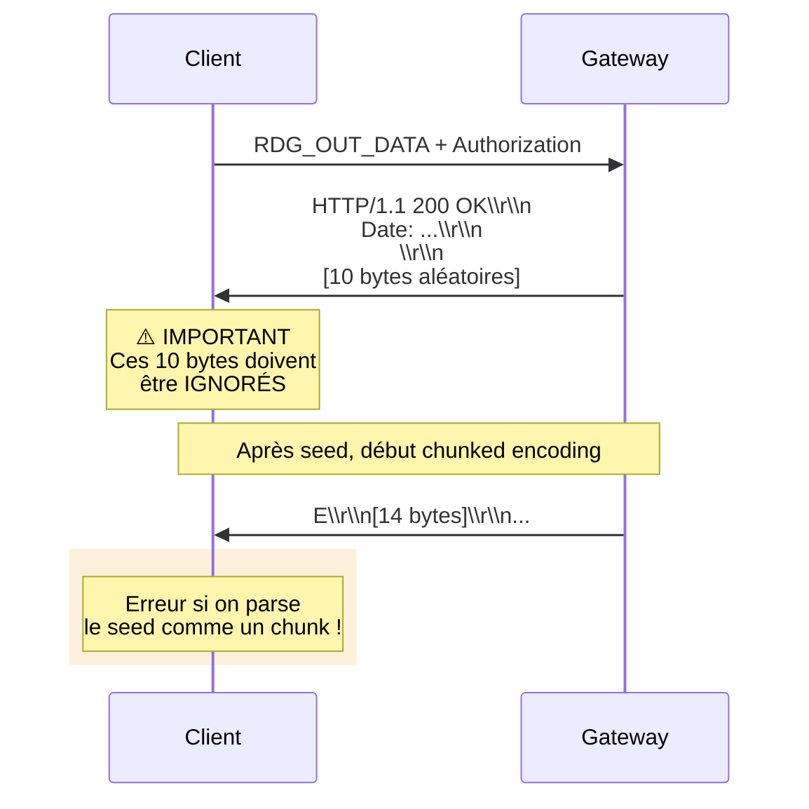
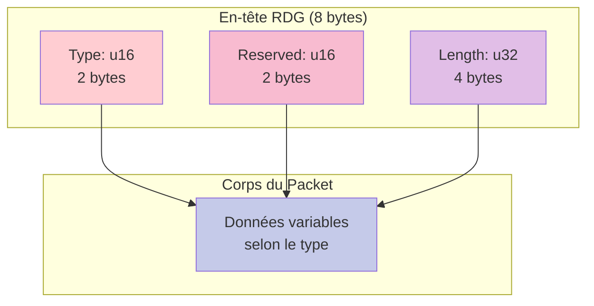
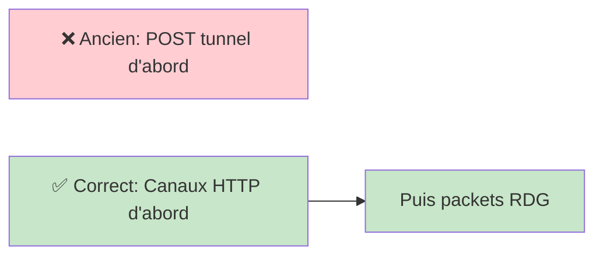
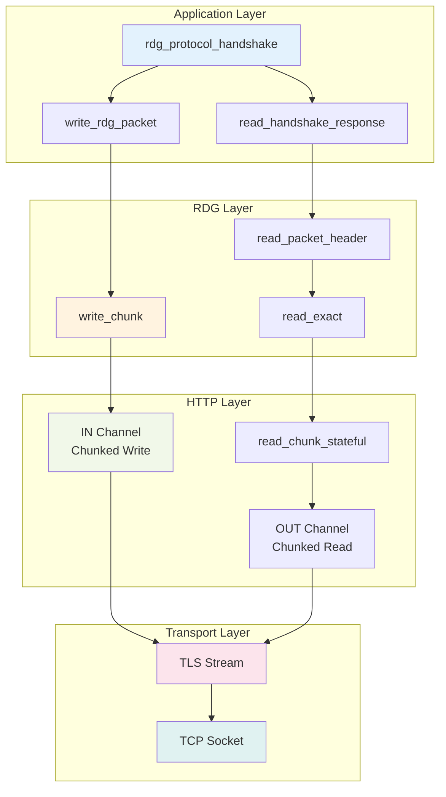

# RDP Gateway Protocol Implementation

Documentation technique de l'implémentation du protocole MS-TSGU (RDP Gateway) pour CyberArk Privilege Cloud.

## Table des Matières

- [Vue d'ensemble](#vue-densemble)
- [Séquence de Connexion](#séquence-de-connexion)
- [HTTP Chunked Encoding](#http-chunked-encoding)
- [Seed Payload](#seed-payload)
- [Packets RDG](#packets-rdg)
- [Découvertes et Problèmes](#découvertes-et-problèmes)

---

## Vue d'ensemble

Le protocole RDP Gateway (MS-TSGU) permet de tunneliser des connexions RDP à travers HTTPS. Il utilise deux canaux HTTP distincts :



### Canaux HTTP



---

## Séquence de Connexion

### Établissement des Canaux



### Handshake RDG Complet



---

## HTTP Chunked Encoding

Le canal OUT utilise le **Transfer-Encoding: chunked** pour envoyer les données sans connaître la longueur totale à l'avance.

### Format des Chunks

```
[Taille en Hex]\r\n
[Données]\r\n
[Taille en Hex]\r\n
[Données]\r\n
0\r\n
\r\n
```

**Exemple :**
```
E\r\n              <- Taille: 14 bytes (0xE)
[14 bytes]\r\n    <- Données du packet handshake
12\r\n             <- Taille: 18 bytes (0x12)
[18 bytes]\r\n    <- Données du packet suivant
0\r\n              <- Fin du stream
\r\n
```

### Machine à États



### Implémentation Rust

```rust
struct ChunkedState {
    state: ChunkStateEnum,          // État actuel
    next_offset: usize,             // Bytes restants dans chunk
    header_footer_pos: usize,       // Position parsing CRLF
    len_buffer: Vec<u8>,            // Buffer pour taille hex
}

enum ChunkStateEnum {
    LengthHeader,  // Parsing taille hex
    Data,          // Lecture données
    Footer,        // Consommation \\r\\n
    End,           // Fin stream
}
```

**Caractéristiques :**
- ✅ Non-bloquant (retourne immédiatement avec données disponibles)
- ✅ Gère les chunks fragmentés
- ✅ Maintient l'état entre les appels
- ✅ Compatible avec lectures partielles

---

## Seed Payload

### Découverte Majeure 🎯

Après avoir reçu **HTTP 200 OK**, le serveur envoie un **seed payload aléatoire** qui doit être **ignoré** avant de commencer à lire les chunks.



### Spécification MS-TSGU

> "The server sends back the final status code 200 OK, and a random entity body of limited size (100 bytes)"

**En pratique** (selon FreeRDP) :
- Taille réelle : **10 bytes** (pas 100)
- Contenu : données aléatoires
- Action : **skip/ignore** avant de lire les chunks

### Code FreeRDP

```c
static BOOL rdg_skip_seed_payload(rdpRdg* rdg, BOOL isWebsocketTransport,
                                  size_t lastResponseLength)
{
    // Spec says 100 bytes, practice shows 10 bytes
    const size_t size = isWebsocketTransport ? 0 : 10;
    BYTE seed_payload[10];

    if (lastResponseLength < size) {
        if (!rdg_read_all(context, tls, seed_payload,
                         size - lastResponseLength, transferEncoding))
            return FALSE;
    }
    return TRUE;
}
```

### Notre Implémentation

```rust
fn new(
    in_channel: TlsStream,
    out_channel: TlsStream,
    seed_payload: Vec<u8>,
) -> Self {
    // Seed payload is SKIPPED, not used
    tracing::info!("Skipping {} bytes of seed payload", seed_payload.len());

    Self {
        // ... other fields
        pending_bytes: Vec::new(),  // Start empty - seed is ignored
        chunk_state: ChunkedState::new(),
    }
}
```

---

## Packets RDG

### Structure Générique

Tous les packets RDG partagent un en-tête commun de **8 bytes** :



### Types de Packets

```rust
enum PacketType {
    HandshakeRequest    = 0x0001,  // Client → Gateway
    HandshakeResponse   = 0x0002,  // Gateway → Client
    TunnelCreate        = 0x0003,  // Client → Gateway
    TunnelResponse      = 0x0004,  // Gateway → Client
    TunnelAuth          = 0x0005,  // Client → Gateway
    TunnelAuthResponse  = 0x0006,  // Gateway → Client
    ChannelCreate       = 0x0007,  // Client → Gateway
    ChannelResponse     = 0x0008,  // Gateway → Client
    Data                = 0x0009,  // Bidirectionnel
    ServiceMessage      = 0x000A,  // Gateway → Client
    Reauth              = 0x000B,  // Client → Gateway
}
```

### Exemple : Handshake Request

```
Offset  | Taille | Champ             | Valeur
--------|--------|-------------------|--------
0x00    | 2      | Type              | 0x0001
0x02    | 2      | Reserved          | 0x0000
0x04    | 4      | Length            | 0x0000000E (14)
0x08    | 4      | Error Code        | 0x00000000
0x0C    | 1      | Version Major     | 0x01
0x0D    | 1      | Version Minor     | 0x00
0x0E    | 2      | Server Version    | 0x0000
0x10    | 2      | Extended Auth     | 0x0001 (PAA)
```

**Total : 14 bytes (0xE en hex)**

---

## Découvertes et Problèmes

### ✅ Problèmes Résolus

#### 1. Confusion sur le Protocole Initial
**Problème :** Nous pensions qu'il fallait créer un tunnel via POST séparé avant les canaux.

**Solution :** Les canaux IN/OUT sont créés AVANT, puis les packets RDG binaires sont échangés à travers ces canaux.



#### 2. Données HTTP Body Perdues
**Problème :** Les données après `\r\n\r\n` dans la réponse HTTP 200 étaient jetées.

**Solution :**
- Extraire le HTTP body avec `extract_http_body()`
- Parser `\r\n\r\n` pour trouver le début du body
- Passer ces données au `GatewayStream`

```rust
fn extract_http_body(buffer: &[u8], len: usize) -> Vec<u8> {
    for i in 0..len.saturating_sub(3) {
        if &buffer[i..i+4] == b"\r\n\r\n" {
            let body_start = i + 4;
            return buffer[body_start..len].to_vec();
        }
    }
    Vec::new()
}
```

#### 3. Seed Payload Non Traité
**Problème :** Les 10 bytes après HTTP 200 étaient parsés comme un chunk, causant des erreurs.

**Solution :**
- Identifier ces bytes comme le "seed payload" de MS-TSGU
- Les ignorer complètement (ne pas les mettre dans `pending_bytes`)
- Commencer à lire les vrais chunks depuis le socket

### ❌ Problème En Cours

#### Blocage sur Handshake Response

**Symptôme :**
```
[INFO] Sending handshake request
[INFO] Waiting for handshake response
[BLOQUE ICI - pas de timeout]
```

**État actuel :**
- ✅ Canaux établis avec succès
- ✅ Seed payload sauté correctement
- ✅ Handshake request envoyé (14 bytes via chunk HTTP)
- ❌ **Pas de réponse du serveur**

**Hypothèses :**

1. **Timing** : Le serveur ne répond peut-être pas immédiatement
   ```mermaid
   sequenceDiagram
       Client->>Gateway: Handshake Request
       Note over Gateway: Traitement ?<br/>Délai ?
       Gateway-->>Client: ??? (pas de réponse)
   ```

2. **Protocole CyberArk** : Variation possible du standard MS-TSGU
   - Peut-être un packet supplémentaire avant le handshake ?
   - Format de packet différent ?

3. **Problème d'envoi** : Les données ne sont peut-être pas flushées
   ```rust
   // Notre code
   self.write_chunk(&buf)?;
   in_chan.flush()?;  // ← Flush explicite
   ```

**Prochaines Actions :**
- 📊 Capture Wireshark pour voir le trafic réel
- 🔍 Comparaison avec logs FreeRDP détaillés
- 🐛 Vérification que les données sont bien envoyées au niveau TCP

---

## Architecture du Code

### Flux de Données



### Structure GatewayStream

```rust
pub struct GatewayStream {
    // Canaux TLS
    in_channel: Arc<Mutex<TlsStream>>,   // Client → Server
    out_channel: Arc<Mutex<TlsStream>>,  // Server → Client

    // Buffers de lecture
    read_buffer: Vec<u8>,      // Données décodées (après chunked)
    read_pos: usize,           // Position dans read_buffer
    pending_bytes: Vec<u8>,    // Données brutes (à décoder)
    pending_pos: usize,        // Position dans pending_bytes

    // Machine à états
    chunk_state: ChunkedState, // État du décodeur chunked
}
```

**Hiérarchie des Buffers :**

```
Socket → pending_bytes → ChunkedDecoder → read_buffer → Application
         (raw HTTP)      (state machine)   (decoded)
```

---

## Références

### Spécifications
- [MS-TSGU: Terminal Services Gateway Server Protocol](https://learn.microsoft.com/en-us/openspecs/windows_protocols/ms-tsgu/)
- [RFC 7230: HTTP/1.1 Message Syntax and Routing (Chunked Transfer)](https://tools.ietf.org/html/rfc7230#section-4.1)

### Code Source FreeRDP
- [rdg.c - RDP Gateway Implementation](https://github.com/FreeRDP/FreeRDP/blob/master/libfreerdp/core/gateway/rdg.c)
- [http.c - HTTP Chunked Encoding](https://github.com/FreeRDP/FreeRDP/blob/master/libfreerdp/core/gateway/http.c)
- [PR #6734 - Implement chunked encoding](https://github.com/FreeRDP/FreeRDP/pull/6734)

### Issues Pertinentes
- [#6731 - Feature request: Implement chunked encoding](https://github.com/FreeRDP/FreeRDP/issues/6731)
- [#6730 - Socket in nonblocking mode busy loop](https://github.com/FreeRDP/FreeRDP/issues/6730)
- [#4539 - RDG HTTP transport fixes and refactoring](https://github.com/FreeRDP/FreeRDP/pull/4539)

---

## Glossaire

| Terme | Description |
|-------|-------------|
| **RDG** | Remote Desktop Gateway - Proxy HTTPS pour RDP |
| **MS-TSGU** | Microsoft Terminal Services Gateway - Protocole RDG |
| **PAA** | Pluggable Authentication Architecture - Méthode d'auth via cookies |
| **SSO Token** | Cookie d'authentification unique (dans fichiers .rdp) |
| **Seed Payload** | 10 bytes aléatoires après HTTP 200, à ignorer |
| **Chunked Encoding** | Format HTTP pour streaming sans Content-Length |
| **IN Channel** | Canal HTTP pour Client → Server (RDG_IN_DATA) |
| **OUT Channel** | Canal HTTP pour Server → Client (RDG_OUT_DATA) |

---

*Dernière mise à jour : 2026-02-08*
